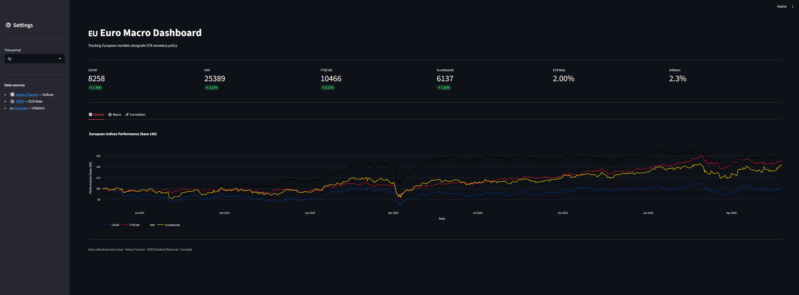

# 🇪🇺 Euro Macro Dashboard

An interactive dashboard tracking European financial markets alongside ECB monetary policy indicators.

Built with Python and Streamlit, this project crosses market performance data with macroeconomic indicators to visualize the relationship between ECB decisions and European indices.



---

## Features

- **Live market data** — CAC40, DAX, FTSE100, EuroStoxx50 via Yahoo Finance
- **ECB monetary policy** — Deposit facility rate history via FRED
- **Euro area inflation** — HICP annual rate via Eurostat official API
- **Normalized performance chart** — Compare indices on a common base 100
- **Macro overlay** — ECB rate vs inflation on dual axis
- **Correlation matrix** — Monthly index returns vs ECB rate changes
- **Adjustable time period** — 6 months, 1 year, 2 years

---

## Tech Stack

- **Python 3.12**
- **Streamlit** — web interface
- **Plotly** — interactive charts
- **yfinance** — market data
- **fredapi** — FRED macroeconomic data
- **eurostat** — Eurostat official API

---

## Installation

```bash
# Clone the repository
git clone https://github.com/your-username/euro-macro-dashboard.git
cd euro-macro-dashboard

# Create virtual environment
python -m venv venv
venv\Scripts\activate.bat  # Windows
source venv/bin/activate   # Mac/Linux

# Install dependencies
pip install -r requirements.txt

# Create .env file
echo FRED_API_KEY=your_api_key_here > .env
```

Get your free FRED API key at [fred.stlouisfed.org](https://fred.stlouisfed.org/docs/api/api_key.html)

---

## Usage

```bash
streamlit run app.py
```

---

## Data Sources

| Data | Source | Update frequency |
|---|---|---|
| European indices | Yahoo Finance | Daily |
| ECB deposit rate | FRED | Daily |
| Euro area HICP inflation | Eurostat | Monthly |

---

## Project Structure

```
euro-macro-dashboard/
├── app.py          # Streamlit application
├── data.py         # Data fetching functions
├── charts.py       # Plotly chart definitions
├── requirements.txt
├── .env            # API keys (not committed)
└── .gitignore
```